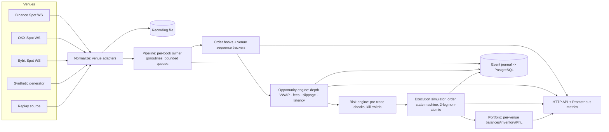

# CrossVenue

**Multi-venue crypto market data, arbitrage detection, risk-gated execution simulation, and deterministic replay.**

CrossVenue is a **trading-systems engineering project**. It demonstrates the
infrastructure problems around cross-exchange market data and execution:
order-book correctness, sequence/gap handling, depth-aware opportunity
pricing, non-atomic two-leg execution, inventory-aware risk, deterministic
record/replay, and restart recovery.

> **CrossVenue does not claim profitable trading performance. Execution is
> simulated by default. No live funds are required and the default
> executable cannot submit real orders.** It is not HFT, not a production
> exchange gateway, and not an alpha-generating strategy.

## What it proves

- Maintaining correct local order books across heterogeneous exchange
  protocols (Binance, OKX, Bybit), each with **venue-specific sequence
  rules**.
- Best-bid/best-ask "arbitrage" is misleading: opportunities are computed
  from **actual depth (VWAP) after configurable fees, modeled slippage, and
  a latency penalty**.
- Two-leg cross-venue execution is **not atomic** — the simulator models
  partial second-leg fills and surfaces residual directional exposure.
- Risk is evaluated **before** execution: notional/exposure limits, stale
  quote rejection, daily loss limit, kill switch.
- **Deterministic record/replay**: same recording + config + seed ⇒
  identical books, opportunity stream, executions, balances, PnL, and
  journal digest (automated parity test).
- Recovery: restart restores portfolio state but **never** resumes trading
  from stored book state; books resynchronize from fresh market data.

## Quick start

```powershell
# Offline demo (no internet, no Postgres): synthetic 3-venue feeds
go run ./cmd/crossvenue --mode synthetic --config config.example.yaml

# Operational API
curl http://127.0.0.1:8471/ready
curl http://127.0.0.1:8471/api/v1/books
curl http://127.0.0.1:8471/api/v1/opportunities

# Live public market data (real feeds, paper execution)
go run ./cmd/crossvenue --mode live-market-sim --config config.example.yaml

# Deterministic replay
go run ./cmd/loadgen --venues 3 --symbols 1 --events-per-second 200 --duration 5s --seed 42 --out data/demo.recording
go run ./cmd/replay --recording data/demo.recording --speed max
go run ./cmd/replay --recording data/demo.recording --speed max   # identical digests

# Docker (engine + Postgres + optional Prometheus)
docker compose up --build
```

## Architecture



See [docs/architecture.md](docs/architecture.md).

## Modes

| Mode | Source | Execution |
|---|---|---|
| `live-market-sim` | Real public WS feeds | Paper (simulated) |
| `synthetic` | Deterministic generator | Paper |
| `replay` | Recording file | Paper, deterministic |

## Failure scenes (automated in tests/integration)

1. Sequence gap → book invalidated, no opportunities, resync.
2. Venue disconnect → venue excluded, others continue.
3. Stale quote → opportunity rejected.
4. Partial second-leg fill → residual exposure journaled.
5. Duplicate client order ID → same logical order returned.
6. Restart → positions restored, books start invalid.
7. Kill switch → new orders blocked immediately.
8. Queue overload → invalidate + resync, never silent delta loss.

## Testing

```powershell
go test ./...          # unit + integration + replay parity
go test -race ./...    # race detector
go test -bench=. -benchmem ./internal/book/
```

## Limitations (read this)

- Public market feeds only; no colocated infrastructure.
- Simulated fills consume observed depth but cannot reproduce queue
  position; real fills would be worse.
- Modeled latency is a configurable penalty, not measured exchange latency.
- Cross-exchange asset transfer is not modeled as instantaneous — each
  venue's inventory is independent.
- No profitability claims; observed spreads frequently vanish after fees.
- No HFT claims. See [docs/limitations.md](docs/limitations.md).

## Safety

Execution is always simulated. There is no code path that submits real
orders; setting `ENABLE_LIVE_EXECUTION=true` makes the binary **refuse to
start** rather than trade. No API keys are required or read.

## Repo layout

```
cmd/crossvenue   main engine (live-market-sim | replay | synthetic)
cmd/replay       deterministic replay runner with digest output
cmd/loadgen      deterministic synthetic recording generator
internal/
  domain/        normalized venue-independent event model
  book/          order book + venue sequence trackers
  marketdata/    per-book owner goroutines, bounded queues, staleness
  opportunity/   depth-aware cost-adjusted opportunity engine
  execution/     order state machine, partial fills, two-leg execution
  risk/          pre-trade checks, kill switch
  portfolio/     per-venue balances, positions, PnL
  journal/       append-only engine event log
  replay/        versioned recording envelope, recorder, reader
  engine/        supervisor wiring; single Ingest path for all modes
  venue/         adapter interfaces + binance/okx/bybit/synthetic/wsbase
  storage/       PostgreSQL operational persistence
  api/           operational HTTP API (health vs ready)
  metrics/       Prometheus surface
pkg/decimal/     fixed-point (1e8) arithmetic — no float64 for money
tests/
  integration/   failure scenes, restart
  replay/        deterministic parity
```
